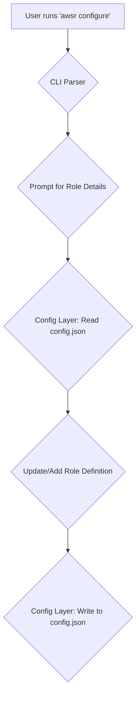

# 🏗️ Architecture Guide

Comprehensive technical architecture documentation for AWS Assume Role CLI.

## 🎯 System Overview

AWS Assume Role CLI is a cross-platform command-line tool built in Rust that simplifies AWS role assumption. It is designed for performance, security, and ease of use.

**Core Components**:
- **Core Binary**: A high-performance, statically-linked Rust CLI (`awsr`).
- **Universal Shell Wrapper**: A single bash script (`aws-assume-role-bash.sh`) for seamless integration with bash-compatible shells (Bash, Zsh, Git Bash).
- **AWS SDK for Rust**: Direct integration with AWS services for robust and secure credential handling, replacing the previous dependency on the AWS CLI.
- **CI/CD Pipeline**: An automated testing and distribution pipeline using GitHub Actions.

## 📊 Architecture Diagram

```mermaid
graph TD
    subgraph "User Interface Layer"
        A["Shell (Bash, Zsh, Git Bash)"] -->|source| B(aws-assume-role-bash.sh)
        B -->|alias 'awsr'| C{Core Binary (aws-assume-role)}
        D["Direct Usage"] --> C
    end

    subgraph "CLI Application Layer (clap)"
        C --> E{Command Parser}
        E -->|assume| F[Assume Role Logic]
        E -->|list| G[List Roles Logic]
        E -->|configure| H[Configuration Logic]
        E -->|--help/--version| I[Help & Version]
    end

    subgraph "Business Logic Layer (Rust)"
        F --> J{AWS SDK Integration}
        G --> K{Configuration Management}
        H --> K
    end

    subgraph "Infrastructure Layer"
        J -- "STS::AssumeRole" --> L(AWS Services via SDK)
        K -- "Read/Write" --> M(File System: config.json)
    end
```

## 🧩 Core Components

### **1. CLI Layer (`src/cli/mod.rs`)**

**Purpose**: Command-line interface and user interaction

**Responsibilities**:
- Parse command-line arguments using `clap`
- Validate user input and provide helpful error messages
- Format output for different shells and use cases
- Coordinate between different modules

**Key Patterns**:
```rust
// Command structure from 'clap'
#[derive(Parser)]
#[command(name = "aws-assume-role", version, about)]
pub struct Cli {
    #[command(subcommand)]
    pub command: Commands,
}

#[derive(Subcommand)]
pub enum Commands {
    Assume { role: String, duration: Option<u32> },
    List,
    Configure,
}
```

**Integration Points**:
- Calls AWS layer for role operations
- Uses Config layer for settings management
- Handles Error layer for user-friendly messages

### **2. AWS Layer (`src/aws/mod.rs`)**

**Purpose**: Direct AWS service integration using the AWS SDK for Rust.

**Responsibilities**:
- Natively assume IAM roles using the `aws-sdk-sts` crate.
- Load AWS configuration and credentials from standard sources (e.g., `~/.aws/config`, environment variables) using `aws-config`.
- Handle credential caching and session management securely.
- Provide a robust, type-safe abstraction over the AWS STS `AssumeRole` API call.

**Key Patterns**:
```rust
// Using the AWS SDK for Rust for STS operations
use aws_config::meta::region::RegionProviderChain;
use aws_sdk_sts::Client as StsClient;

pub async fn assume_role(role_arn: &str, duration: i32) -> Result<aws_sdk_sts::types::Credentials, Box<dyn std::error::Error>> {
    let region_provider = RegionProviderChain::default_provider().or_else("us-east-1");
    let config = aws_config::from_env().region(region_provider).load().await;
    let client = StsClient::new(&config);

    let response = client
        .assume_role()
        .role_arn(role_arn)
        .role_session_name("aws-assume-role-session")
        .duration_seconds(duration)
        .send()
        .await?;

    Ok(response.credentials.unwrap())
}
```

**Architectural Shift**: This layer represents a critical architectural change from the previous version, which shelled out to the AWS CLI. By using the official AWS SDK, we gain:
- **Performance**: No overhead from starting an external process.
- **Security**: No risk of command injection and better handling of credentials.
- **Reliability**: Type-safe interaction with the AWS API, reducing parsing errors.
- **No AWS CLI Dependency**: The tool is now fully self-contained.

**Integration Points**:
- Requires AWS CLI v2 to be installed
- Reads AWS configuration and credentials
- Integrates with Config layer for role definitions

### **3. Configuration Layer (`src/config/mod.rs`)**

**Purpose**: Configuration file management and user preferences

**Responsibilities**:
- Load and save configuration files
- Manage role definitions and user preferences
- Handle cross-platform file paths
- Provide default values and validation

**Key Patterns**:
```rust
// Configuration structure
#[derive(Serialize, Deserialize, Debug, Clone)]
pub struct Config {
    pub roles: HashMap<String, RoleConfig>,
    pub default_duration: u32,
    pub default_region: Option<String>,
}

// Cross-platform path handling
pub fn get_config_path() -> PathBuf {
    // Check both HOME and USERPROFILE for cross-platform support
    if let Ok(home) = env::var("HOME") {
        return PathBuf::from(home).join(".aws-assume-role");
    }
    if let Ok(userprofile) = env::var("USERPROFILE") {
        return PathBuf::from(userprofile).join(".aws-assume-role");
    }
    dirs::home_dir().unwrap_or_default().join(".aws-assume-role")
}
```

**Integration Points**:
- Used by CLI layer for role lookups
- Integrates with AWS layer for credential storage
- Handles Error layer for configuration issues

### **4. Error Layer (`src/error/mod.rs`)**

**Purpose**: Structured error handling and user-friendly messages

**Responsibilities**:
- Define error types for different failure modes
- Provide actionable error messages
- Chain errors with context preservation
- Enable debugging while maintaining user experience

**Key Patterns**:
```rust
// Structured error types using thiserror
#[derive(Error, Debug)]
pub enum CliError {
    #[error("AWS CLI not found. Please install AWS CLI v2")]
    AwsCliNotFound,
    
    #[error("Failed to assume role '{role}': {source}")]
    AssumeRoleFailed { 
        role: String, 
        #[source] source: Box<dyn std::error::Error> 
    },
    
    #[error("Configuration error: {0}")]
    ConfigError(String),
}
```

**Integration Points**:
- Used by all layers for consistent error handling
- Provides user-friendly messages in CLI layer
- Preserves technical details for debugging

## 🔄 Data Flow

### **Typical Role Assumption Flow**

```mermaid
graph TD
    A[User runs 'awsr assume <role>'] --> B{CLI Parser};
    B --> C{Config Layer: Look up Role ARN};
    C --> D{AWS Layer: Call assume_role()};
    D --> E{AWS SDK for Rust: STS Client};
    E -- "AssumeRole API Call" --> F[AWS STS Service];
    F -- "Temporary Credentials" --> E;
    E --> D;
    D -- "Credentials Result" --> B;
    B --> G[Output Layer: Format as shell exports];
    G --> H[User sources output to set ENV VARS];
```

### **Configuration Management Flow**



## 🏗️ Design Patterns

### **1. Cross-Platform Compatibility**

**Challenge**: Different operating systems have different conventions for:
- Environment variables (`HOME` vs `USERPROFILE`)
- File paths (Unix `/` vs Windows `\`)
- Shell integration (Bash vs PowerShell vs CMD)

**Solution**: Environment variable checking with fallbacks
```rust
pub fn get_config_path() -> PathBuf {
    // Production: Use both environment variables for cross-platform support
    if let Ok(home) = env::var("HOME") {
        return PathBuf::from(home).join(".aws-assume-role");
    }
    if let Ok(userprofile) = env::var("USERPROFILE") {
        return PathBuf::from(userprofile).join(".aws-assume-role");
    }
    
    // Fallback to dirs crate
    dirs::home_dir()
        .unwrap_or_else(|| PathBuf::from("."))
        .join(".aws-assume-role")
}
```

### **2. Shell Integration Strategy**

**Challenge**: Different shells require different syntax for:
- Environment variable export
- Function definition
- Error handling

**Solution**: Shell-specific wrapper scripts
```bash
# Bash/Zsh wrapper
awsr() {
    local output
    output=$(command awsr "$@" 2>&1)
    local exit_code=$?
    
    if [ $exit_code -eq 0 ] && [[ "$1" == "assume" ]]; then
        eval "$output"
    else
        echo "$output"
    fi
    
    return $exit_code
}
```

### **3. Error Handling Strategy**

**Challenge**: Provide actionable error messages while preserving technical details

**Solution**: Layered error types with context
```rust
// High-level user errors
#[derive(Error, Debug)]
pub enum CliError {
    #[error("AWS CLI not found. Please install AWS CLI v2")]
    AwsCliNotFound,
}

// Detailed technical errors preserved in source chain
impl From<std::io::Error> for CliError {
    fn from(err: std::io::Error) -> Self {
        CliError::IoError { source: err }
    }
}
```

### **4. Configuration Management**

**Challenge**: Flexible configuration with sensible defaults

**Solution**: Layered configuration resolution
```rust
// 1. Built-in defaults
// 2. User configuration file
// 3. Command-line arguments
// 4. Environment variables (highest priority)

pub fn resolve_config(cli_args: &CliArgs) -> Config {
    let mut config = Config::default();
    config.merge_from_file();
    config.merge_from_env();
    config.merge_from_args(cli_args);
    config
}
```

## 🧪 Testing Architecture

### **Test Structure (60 Total Tests)**

```
Testing Framework:
├── Unit Tests (23 tests)
│   ├── Configuration module tests
│   ├── Error handling tests
│   ├── AWS integration tests
│   └── CLI parsing tests
├── Integration Tests (14 tests)
│   ├── End-to-end CLI functionality
│   ├── Cross-platform compatibility
│   ├── Configuration workflows
│   └── Error scenarios
└── Additional Tests (23 tests)
    ├── Performance benchmarks
    ├── Cross-platform utilities
    └── Serialization helpers
```

### **Test Isolation Patterns**

**Environment Variable Testing**:
```rust
#[test]
#[serial_test::serial]  // Prevent race conditions
fn test_cross_platform_config() {
    // Store original values
    let original_home = env::var("HOME").ok();
    let original_userprofile = env::var("USERPROFILE").ok();
    
    // Test logic with isolated environment
    
    // Restore original values
    restore_env_vars(original_home, original_userprofile);
}
```

**File System Testing**:
```rust
#[test]
fn test_config_operations() {
    let temp_dir = TempDir::new().unwrap();
    env::set_var("HOME", temp_dir.path());
    
    // Test config operations in isolation
    
    // Automatic cleanup on test completion
}
```

## 🚀 Performance Considerations

### **Optimization Strategies**

**1. Minimal Dependencies**
- Use lightweight crates where possible
- Avoid heavy runtime dependencies
- Prefer standard library when sufficient

**2. Efficient AWS CLI Integration**
- Cache AWS CLI path discovery
- Reuse process handles when possible
- Parse JSON responses efficiently

**3. Fast Startup Time**
- Lazy initialization of expensive operations
- Minimal work in main() function
- Defer AWS CLI calls until needed

### **Benchmarking Framework**

```rust
// Performance benchmarks in benches/performance.rs
#[bench]
fn bench_config_load(b: &mut Bencher) {
    b.iter(|| {
        // Benchmark configuration loading
    });
}

#[bench]
fn bench_role_assumption(b: &mut Bencher) {
    b.iter(|| {
        // Benchmark end-to-end role assumption
    });
}
```

## 🔒 Security Architecture

### **Security Principles**

**1. Credential Isolation**
- Never log sensitive credentials
- Use secure temporary file handling
- Clear credentials from memory when possible

**2. Input Validation**
- Validate all user inputs
- Sanitize shell command construction
- Prevent command injection attacks

**3. Dependency Security**
- Regular security audits (`cargo audit`)
- Minimal dependency surface
- Use well-maintained crates

### **Secure Coding Patterns**

```rust
// Secure command construction
fn build_aws_command(role_arn: &str) -> Command {
    let mut cmd = Command::new("aws");
    cmd.arg("sts")
       .arg("assume-role")
       .arg("--role-arn")
       .arg(role_arn);  // Properly escaped argument
    cmd
}

// Secure temporary file handling
fn write_temp_credentials(creds: &Credentials) -> Result<PathBuf> {
    let mut temp_file = NamedTempFile::new()?;
    temp_file.write_all(creds.to_json().as_bytes())?;
    Ok(temp_file.into_temp_path().to_path_buf())
}
```

## 📦 Distribution Architecture

### **Multi-Platform Build Strategy**

```
Build Targets:
├── x86_64-unknown-linux-gnu     # Linux
├── x86_64-pc-windows-gnu        # Windows
├── x86_64-apple-darwin          # macOS Intel
└── aarch64-apple-darwin         # macOS Apple Silicon
```

### **Package Distribution**

```
Distribution Channels:
├── Cargo (crates.io)            # Rust package manager
├── Homebrew (macOS/Linux)       # Popular package manager
├── APT (Debian/Ubuntu)          # Linux package manager
├── DNF/YUM (Fedora/RHEL)        # Linux package manager
├── GitHub Releases              # Direct download
└── Docker Images                # Container distribution
```

### **Release Automation**

```
CI/CD Pipeline:
├── Code Quality Gates
│   ├── Formatting check
│   ├── Clippy linting
│   ├── Security audit
│   └── Test suite (60 tests)
├── Multi-Platform Builds
│   ├── Linux x86_64
│   ├── Windows x86_64
│   └── macOS universal
└── Automated Distribution
    ├── GitHub release creation
    ├── Package manager updates
    └── Container image publishing
```

## 🔧 Development Architecture

### **Development Workflow**

```
Development Process:
├── Feature Development
│   ├─ feature/* branches
│   ├─ Comprehensive testing
│   └─ Code review process
├── Quality Assurance
│   ├─ Mandatory formatting
│   ├─ Zero clippy warnings
│   └─ Cross-platform testing
└── Release Management
    ├─ Semantic versioning
    ├─ Automated changelog
    └─ Multi-channel distribution
```

### **Code Organization**

```
Source Structure:
├── src/
│   ├── main.rs              # Entry point
│   ├── lib.rs               # Library interface
│   ├── cli/mod.rs           # CLI handling
│   ├── aws/mod.rs           # AWS integration
│   ├── config/mod.rs        # Configuration
│   └── error/mod.rs         # Error handling
├── tests/                   # Test suite
├── benches/                 # Performance tests
└── releases/                # Distribution artifacts
```

## 📚 Technology Stack

### **Core Technologies**

| Component | Technology | Purpose |
|-----------|------------|---------|
| **Language** | Rust 1.70+ | Performance, safety, cross-platform |
| **CLI Framework** | clap 4.x | Argument parsing and help generation |
| **Error Handling** | thiserror | Structured error types |
| **Serialization** | serde + serde_json | Configuration and AWS response parsing |
| **Testing** | cargo test + assert_cmd | Comprehensive test framework |
| **Cross-Platform** | dirs crate | Platform-specific directory handling |

### **Development Tools**

| Tool | Purpose |
|------|---------|
| **rustfmt** | Code formatting (enforced) |
| **clippy** | Linting and best practices |
| **cargo-audit** | Security vulnerability scanning |
| **criterion** | Performance benchmarking |
| **tarpaulin** | Code coverage analysis |

### **Infrastructure**

| Component | Technology |
|-----------|------------|
| **CI/CD** | GitHub Actions |
| **Package Hosting** | Multiple (Cargo, Homebrew, APT, COPR) |
| **Container Registry** | GitHub Container Registry |
| **Documentation** | Markdown + GitHub Pages |

## 🎯 Future Architecture Considerations

### **Planned Enhancements**

1. **Native AWS SDK Integration**: Reduce dependency on AWS CLI
2. **Configuration UI**: Web-based configuration management
3. **Plugin Architecture**: Extensible functionality
4. **Enhanced Shell Integration**: More shell-specific features

### **Scalability Considerations**

1. **Multi-Account Support**: Enhanced organization support
2. **Caching Layer**: Improve performance for repeated operations
3. **Audit Logging**: Comprehensive usage tracking
4. **Configuration Sync**: Cloud-based configuration sharing

This architecture provides a solid foundation for a reliable, cross-platform AWS role assumption tool while maintaining simplicity and performance. 