# 🛠️ Developer Workflow Guide

Complete development workflow for AWS Assume Role CLI, including the critical safe release process and automated quality gates.

## 📋 Table of Contents

- [Development Setup](#-development-setup)
- [Pre-Commit Quality Gates](#-pre-commit-quality-gates-recommended)
- [Daily Development Flow](#-daily-development-flow)
- [Testing & Quality Gates](#-testing--quality-gates)
- [Safe Release Process](#-safe-release-process-critical)
- [GitHub Actions Integration](#-github-actions-integration)
- [Troubleshooting](#-troubleshooting)

## 🚀 Development Setup

### Cross-Compilation Toolchain (Required for v1.3.0+)

```bash
# Install cross-compilation tools (macOS)
brew install musl-cross mingw-w64 cmake

# Add Rust targets
rustup target add x86_64-unknown-linux-musl
rustup target add x86_64-pc-windows-gnu

# Verify .cargo/config.toml exists with proper linker configuration
```

### Environment Setup

```bash
# Clone and setup
git clone https://github.com/holdennguyen/aws-assume-role.git
cd aws-assume-role

# Build and test
cargo build --release
cargo test  # Should pass all 79 tests

# Test cross-platform builds
./scripts/build-releases.sh
```

## 🛡️ Pre-Commit Quality Gates (RECOMMENDED)

### ⭐ Automated Quality Assurance Script

**NEW**: The project now includes a comprehensive pre-commit script that automates all quality checks and prevents CI failures.

```bash
# Install the pre-commit script (one-time setup)
cp scripts/pre-commit-hook.sh .git/hooks/pre-commit
chmod +x .git/hooks/pre-commit

# OR run manually before each commit (recommended workflow)
./scripts/pre-commit-hook.sh
```

### What the Pre-Commit Script Does

The `scripts/pre-commit-hook.sh` script performs comprehensive quality checks:

```bash
🔍 Running pre-commit quality checks...
📝 Checking code formatting...        # cargo fmt --check
🔍 Running clippy linting...          # cargo clippy -- -D warnings  
🧪 Running tests...                   # cargo test (all 79 tests)
🏗️ Checking build...                 # cargo build --release
```

**Success Output**:
```bash
🎉 All quality checks passed! Proceeding with commit...
📊 Quality gates: ✅ Format ✅ Clippy ✅ Tests ✅ Build
```

**Failure Prevention**:
- **Catches formatting issues** before they reach CI (prevents Windows CI failures)
- **Identifies cross-platform compilation problems** early
- **Validates all tests pass** across the complete test suite
- **Ensures clean builds** for all platforms

### Benefits of Using Pre-Commit Script

✅ **Prevents CI Failures**: Catches issues locally before they reach GitHub Actions  
✅ **Saves Development Time**: No more waiting for CI to fail on formatting  
✅ **Consistent Quality**: Enforces the same standards across all developers  
✅ **Cross-Platform Safety**: Validates code works on all target platforms  
✅ **Early Problem Detection**: Identifies issues when they're easiest to fix  

## 🔄 Daily Development Flow

### ⚠️ RECOMMENDED: Use Pre-Commit Script for All Changes

**NEW WORKFLOW** (Recommended - prevents all CI failures):

```bash
# 1. Make your code changes
# 2. Run comprehensive quality checks
./scripts/pre-commit-hook.sh

# If all checks pass:
git add . && git commit -m "your message"
git push origin your-branch

# If checks fail, fix issues and re-run until passing
```

### ⚠️ ALTERNATIVE: Manual Quality Gates (Error-Prone)

**LEGACY WORKFLOW** (Still supported but more error-prone):

```bash
# MANDATORY before every commit - NO EXCEPTIONS
cargo fmt                          # Fix formatting (REQUIRED)
cargo fmt --check                  # Verify formatting (REQUIRED)
cargo clippy -- -D warnings        # Fix linting (REQUIRED)
cargo test                         # All 79 tests must pass (REQUIRED)

# Only commit after ALL checks pass
git add . && git commit -m "your message"
git push origin your-branch
```

**Why Pre-Commit Script is Better**:
- **Prevents human error**: No forgetting to run `cargo fmt`
- **Comprehensive checks**: Runs all quality gates in correct order
- **Clear feedback**: Shows exactly what passed/failed
- **Time saving**: One command instead of four separate commands

### Feature Development Cycle

```bash
# 1. Start clean
git checkout main && git pull origin main
git checkout -b feature/your-feature

# 2. Test-driven development
# - Write failing tests first
# - Implement incrementally
# - Keep commits focused

# 3. RECOMMENDED: Use pre-commit script frequently
./scripts/pre-commit-hook.sh        # Comprehensive quality gates

# 4. Cross-platform validation (if needed)
./scripts/build-releases.sh        # Build all platforms
./releases/aws-assume-role-macos --version
./releases/aws-assume-role-linux --version
./releases/aws-assume-role-windows.exe --version

# 5. Test universal wrapper
source ./releases/aws-assume-role-bash.sh
awsr --version
```

### Pull Request Workflow

```bash
# Pre-PR checklist (RECOMMENDED)
git rebase main
./scripts/pre-commit-hook.sh       # ✅ All quality gates in one command

# Alternative manual approach (more error-prone)
cargo fmt && cargo fmt --check     # Format AND verify (CRITICAL)
cargo clippy -- -D warnings        # Zero warnings
cargo test                         # All 79 tests pass
./scripts/build-releases.sh        # Cross-platform validation

# Create PR with conventional commits
# Title: feat:, fix:, docs:, etc.
# CI will run comprehensive validation
```

## 🧪 Testing & Quality Gates

### Test Suite Structure (79 Tests Total)

- **Unit Tests**: 23 tests (core functionality)
- **Integration Tests**: 14 tests (AWS integration)
- **Shell Integration**: 19 tests (universal wrapper)
- **Additional Tests**: 23 tests (utilities)

### Quality Standards (Zero Tolerance)

```bash
# These MUST pass before any commit
cargo fmt --check                  # Zero formatting violations
cargo clippy -- -D warnings       # Zero linting warnings
cargo test                         # 100% test success rate
cargo audit                        # Zero security vulnerabilities
```

## 🎯 Safe Release Process (CRITICAL)

### The "Release from Develop" Workflow Philosophy

This project uses a **GitFlow-like** branching model where releases are tagged from the `develop` branch *before* merging into `main`. This is a deliberate and robust strategy.

**Branch Roles:**
- **`develop`**: The integration branch for the "next release." All CI checks run here.
- **`main`**: The production branch. It only contains code from successfully completed releases.
- **`tags` (e.g., `v1.3.0`)**: Immutable pointers to a specific commit on `develop` that represents a formal, published release.

**Why Release Before Merging to `main`?**
- ✅ **Maximum Confidence**: The release is built from the *exact* commit that passed all CI checks on `develop`, eliminating any chance of last-minute issues.
- ✅ **`main` is Always Production-Ready**: The `main` branch is a clean, stable history of official releases. You can trust it completely.
- ✅ **Clear Automation Trigger**: A Git tag is the perfect, unambiguous trigger for the automated release pipeline.
- ✅ **Decoupled Process**: It separates the *act of releasing* from the *act of updating the production branch*. The merge to `main` is a simple, safe finalization step.

### Visual Workflow

```mermaid
graph TD
    subgraph "Development"
        A[Feature Branch] -->|Pull Request| B(Merge to develop)
    end
    subgraph "Validation"
        B -->|Git Push| C{CI Checks on 'develop'}
        C -->|All Pass ✅| D[Ready for Release]
    end
    subgraph "Release Trigger"
        D -->|Manual Action| E(Git Tag 'v1.3.0')
    end
    subgraph "Automated Release"
        E -->|Triggers Workflow| F{Release Pipeline}
        F --> G[Publish Artifacts]
    end
    subgraph "Finalization"
        G -->|Release Success ✅| H(Merge 'develop' to 'main')
        H --> I[Push 'main']
    end
```



### ⚠️ CRITICAL RULE: Never Tag Before CI Passes

The GitHub Actions workflow can fail for various reasons. **ALWAYS** wait for CI validation before creating release tags.

### Phase 1: Prepare Release

```bash
# 1. Prepare release with unified script
./scripts/release.sh prepare 1.3.0

# This automatically:
# - Updates version in Cargo.toml
# - Creates/updates release notes
# - Validates version consistency
# - Stages changes for commit
```

### Phase 2: Push and Wait for CI ⚠️ CRITICAL

```bash
# 2. Commit and push to develop (NOT main, NOT tagged yet)
git add . && git commit -m "🔖 Prepare release v1.3.0"
git push origin develop

# 3. CRITICAL: Wait for GitHub Actions to PASS
# Visit: https://github.com/holdennguyen/aws-assume-role/actions
# 
# Wait for ALL these to complete successfully:
# ✅ Code Quality & Testing (Ubuntu, Windows, macOS)
# ✅ Cross-Platform Build (Linux musl, macOS, Windows)
# ✅ Security Audit (advisory but should complete)
# 
# DO NOT proceed until you see: ✅ All checks have passed
```

### Phase 3: Create Release Tag

```bash
# 4. ONLY after CI passes, create and push tag
git tag -a v1.3.0 -m "Release v1.3.0

🚀 Major Release: Cross-Platform Build Infrastructure

Key Features:
- Cross-compilation toolchain setup
- Universal bash wrapper for all platforms
- Automated build pipeline
- Enhanced test suite (79 tests)"

git push origin v1.3.0
```

### Phase 4: Finalize the Release (Merge to Main)

After the tag is pushed, the automated release pipeline will run. **Once you confirm the release was successful**, the final step is to merge the `develop` branch into `main` to bring the production branch up to date.

```bash
# 1. Switch to the main branch and pull latest changes
git checkout main
git pull origin main

# 2. Merge the develop branch into main
git merge develop

# 3. Push the updated main branch
git push origin main
```

### Phase 5: Automated Release Pipeline

The tag push triggers the full automated release pipeline:

1. **GitHub Release**: Automatic creation with binaries
2. **Cargo Publishing**: If `CARGO_REGISTRY_TOKEN` available
3. **Homebrew Update**: If `HOMEBREW_TAP_TOKEN` available
4. **Container Images**: Multi-platform Docker images
5. **Distribution Packages**: tar.gz/zip with checksums

### ❌ What NOT to Do

```bash
# WRONG - This can cause failed releases
git tag v1.3.0 && git push origin v1.3.0  # DON'T DO THIS

# WRONG - Tagging without CI validation
./scripts/release.sh prepare 1.3.0
git add . && git commit -m "Release v1.3.0"
git tag v1.3.0 && git push origin v1.3.0  # DANGEROUS

# RIGHT - Safe release process
./scripts/release.sh prepare 1.3.0
git add . && git commit -m "🔖 Prepare release v1.3.0"
git push origin develop                    # Push first
# Wait for ✅ GitHub Actions success
git tag v1.3.0 && git push origin v1.3.0  # Then tag
```

## 🤖 GitHub Actions Integration

### Workflow Triggers

- **Every Push/PR**: Quality gates (tests, clippy, format)
- **Push to main/develop**: + Cross-platform builds + Security audit
- **Tag push (v*)**: + Full release pipeline

### Monitoring Workflows

```bash
# Check recent workflow runs (requires gh auth login)
gh run list --limit 5

# Watch current workflow
gh run watch

# View failed run details
gh run view <run-id> --log
```

### Common CI Failures and Fixes

| Failure Type | Common Cause | Fix | Prevention |
|-------------|--------------|-----|------------|
| **Format Check** | Unformatted code | `cargo fmt` | **ALWAYS** run `cargo fmt` after code changes |
| Clippy Warnings | Linting violations | `cargo clippy -- -D warnings` | Run clippy during development |
| Test Failures | Broken functionality | Fix code, `cargo test` | Write tests first, run frequently |
| Cross-Compilation | Missing toolchain | Install musl-cross, mingw-w64 | Verify toolchain setup |
| Missing Files | Incomplete build | Ensure all required files exist | Run build scripts before push |

### ⚠️ CRITICAL: Formatting Issue Prevention

**Most Common CI Failure**: Code formatting violations

**Real Example** (v1.3.0 Windows CI fix):
```bash
# Problem: Windows CI failed on Unix-specific code
# Detection: Pre-commit script caught cross-platform issue
./scripts/pre-commit-hook.sh
# 🔍 Running pre-commit quality checks...
# ❌ Code formatting issues found!

# Solution: Fix and re-run
cargo fmt
./scripts/pre-commit-hook.sh
# 🎉 All quality checks passed!
```

**WRONG** - This WILL cause CI failure:
```bash
# 1. Edit code
# 2. git add . && git commit -m "changes"
# 3. git push  # ❌ CI fails on formatting
```

**RIGHT** - This prevents CI failure:
```bash
# 1. Edit code
# 2. ./scripts/pre-commit-hook.sh    # ✅ RECOMMENDED
# 3. git add . && git commit -m "changes"
# 4. git push                        # ✅ CI passes
```

**Manual Alternative** (more error-prone):
```bash
# 1. Edit code
# 2. cargo fmt                    # ✅ MANDATORY
# 3. cargo fmt --check           # ✅ Verify formatting
# 4. git add . && git commit -m "changes"
# 5. git push                    # ✅ CI passes
```

**Formatting Emergency Fix**:
```bash
# If you already pushed and CI is failing on formatting:
cargo fmt                          # Fix formatting
git add . && git commit -m "fix: apply formatting"
git push origin your-branch        # Push fix
```

### 🔧 Pre-Commit Script Installation Options

**Option 1: Manual Execution** (Recommended for all developers):
```bash
# Run before each commit
./scripts/pre-commit-hook.sh
```

**Option 2: Git Hook Installation** (Advanced users):
```bash
# Install as automatic git hook
cp scripts/pre-commit-hook.sh .git/hooks/pre-commit
chmod +x .git/hooks/pre-commit

# Now every commit will automatically run quality checks
# Can be bypassed with: git commit --no-verify
```

**Benefits of Pre-Commit Script**:
- ✅ Prevents CI failures by catching issues locally
- ✅ Saves time by avoiding failed pushes  
- ✅ Ensures consistent quality across all commits
- ✅ Provides clear feedback on what needs fixing
- ✅ Validates cross-platform compatibility

**When Pre-Commit Script Catches Issues**:
```bash
./scripts/pre-commit-hook.sh
# 🔍 Running pre-commit quality checks...
# 📝 Checking code formatting...
# ❌ Code formatting issues found!
# 💡 Fix with: cargo fmt

# Fix the issue:
cargo fmt

# Re-run to verify:
./scripts/pre-commit-hook.sh
# 🎉 All quality checks passed! Proceeding with commit...
```

## 🔧 Troubleshooting

### Release Process Issues

**Problem**: GitHub Actions failed after pushing to develop
```bash
# Solution: Fix issues and push again (don't tag yet)
cargo fmt && cargo clippy -- -D warnings && cargo test
git add . && git commit -m "fix: resolve CI issues"
git push origin develop
# Wait for ✅ success, then proceed with tagging
```

**Problem**: Accidentally tagged before CI passed
```bash
# Solution: Remove tag and restart process
git tag -d v1.3.0                    # Delete local tag
git push origin :refs/tags/v1.3.0    # Delete remote tag
# Fix issues, push to develop, wait for CI, then re-tag
```

### Cross-Compilation Issues

**Problem**: Linux musl build fails
```bash
# Check toolchain installation
brew list musl-cross
rustup target list --installed | grep musl

# Reinstall if needed
brew reinstall musl-cross
rustup target add x86_64-unknown-linux-musl
```

**Problem**: Windows cross-compilation fails
```bash
# Check MinGW installation
brew list mingw-w64
rustup target list --installed | grep windows-gnu

# Reinstall if needed
brew reinstall mingw-w64
rustup target add x86_64-pc-windows-gnu
```

### Test Failures

**Problem**: Shell integration tests fail
```bash
# Ensure universal wrapper exists
ls -la releases/aws-assume-role-bash.sh

# Rebuild if missing
./scripts/build-releases.sh

# Test wrapper manually
source ./releases/aws-assume-role-bash.sh
awsr --version
```

## 📊 Quality Metrics

### Current Standards (v1.3.0)

- **Test Coverage**: 79 tests (100% must pass)
- **Code Quality**: Zero clippy warnings, perfect formatting
- **Security**: Zero known vulnerabilities
- **Cross-Platform**: Linux musl, macOS aarch64, Windows MSVC
- **Performance**: < 100ms startup, < 50MB memory usage

### Release Checklist

- [ ] All 79 tests pass locally
- [ ] Code formatted (`cargo fmt`)
- [ ] No clippy warnings (`cargo clippy -- -D warnings`)
- [ ] Cross-platform builds successful
- [ ] Universal wrapper tested
- [ ] Release notes updated
- [ ] Version bumped in Cargo.toml
- [ ] Pushed to develop branch
- [ ] **GitHub Actions passed** ✅
- [ ] Tag created and pushed
- [ ] Release pipeline completed

---

**Remember**: The safe release process is critical. Always wait for GitHub Actions to pass before creating release tags. This prevents failed releases and maintains the project's quality standards. 